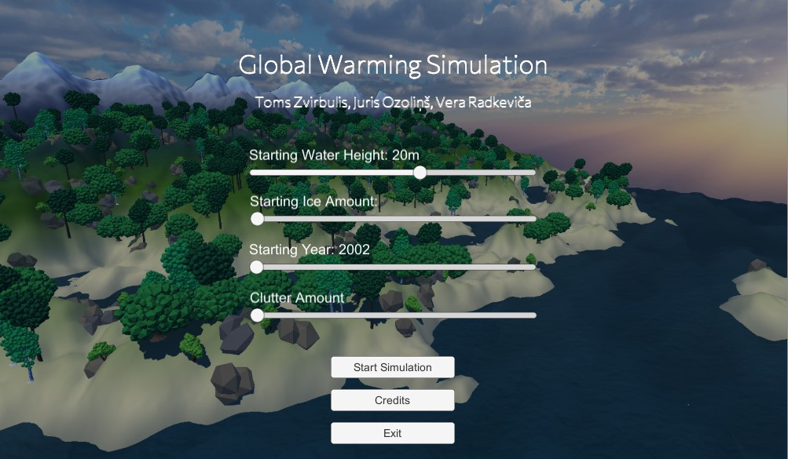
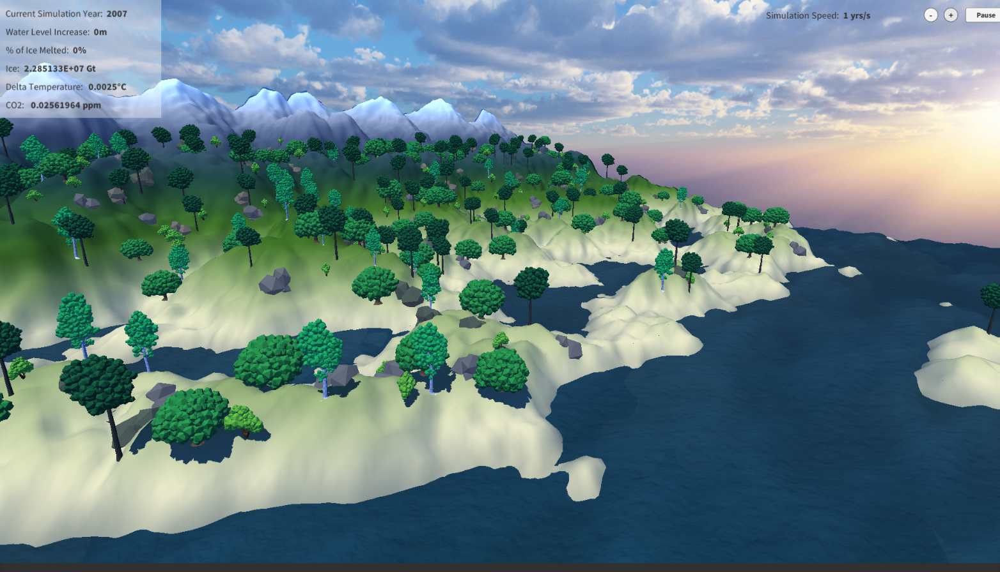

# Ventspils ITC 2020 - Olimps

Global warming water level simulation

## Description

This simulation is primarely based on data anylisis of NASA's provided data about climate change, global temperature. It models water level changes over the next centuries depending on provided ice amount, following current trends in the world.

## Running

Download the repository and run the `.exe` in the `Build` directory

## Images

### Main Menu

### Simulation

## Information sources

http://www.antarcticglaciers.org/glaciers-and-climate/estimating-glacier-contribution-to-sea-level-rise/

https://www.usgs.gov/special-topic/water-science-school/science/how-much-water-there-earth?qt-science_center_objects=0#qt-science_center_objects

https://www.pnas.org/content/106/51/21527

https://www.climate.gov/news-features/understanding-climate/2012-state-climate-sea-surface-temperature

https://ocean.si.edu/through-time/ancient-seas/sea-level-rise

https://courses.lumenlearning.com/physics/chapter/13-2-thermal-expansion-of-solids-and-liquids/

https://www.climate.gov/news-features/understanding-climate/climate-change-global-temperature

https://climate.nasa.gov/vital-signs/carbon-dioxide/

https://climate.nasa.gov/vital-signs/global-temperature/

https://climate.nasa.gov/vital-signs/ice-sheets/

https://climate.nasa.gov/vital-signs/sea-level/

http://www.antarcticglaciers.org/glaciers-and-climate/what-is-the-global-volume-of-land-ice-and-how-is-it-changing/

https://www.climate.gov/news-features/understanding-climate/climate-change-atmospheric-carbon-dioxide

https://climate.nasa.gov/climate_resources/199/rising-tides-understanding-sea-level-rise/
